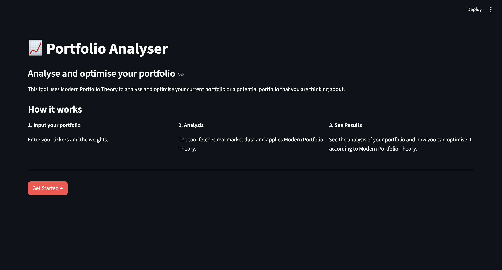
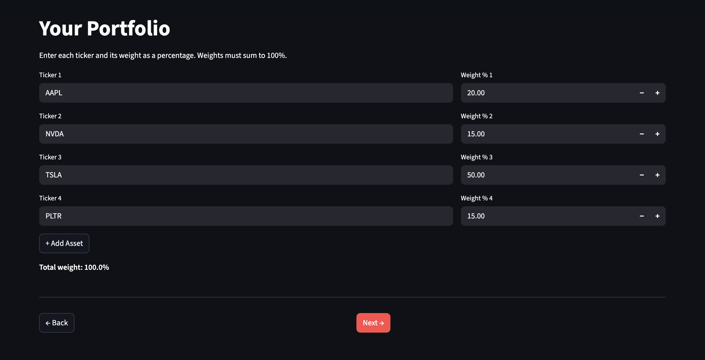
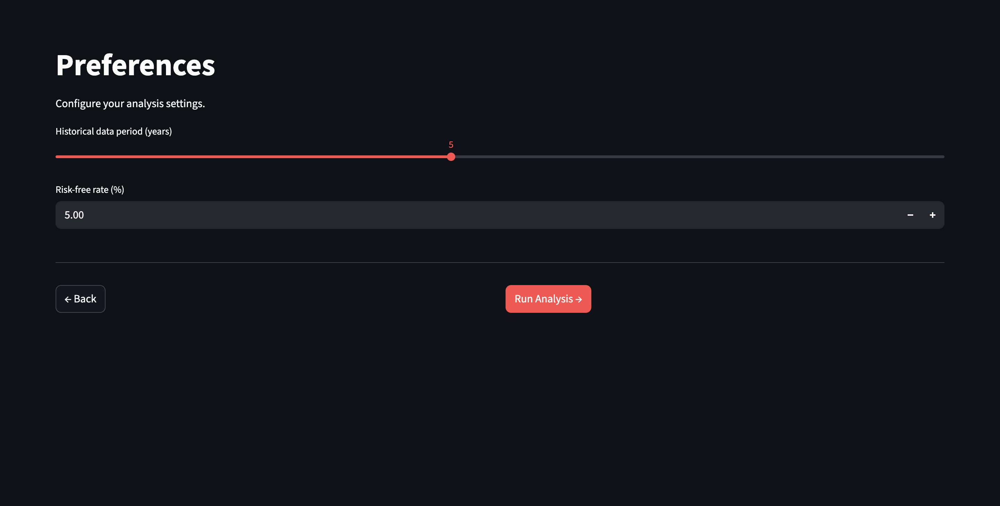
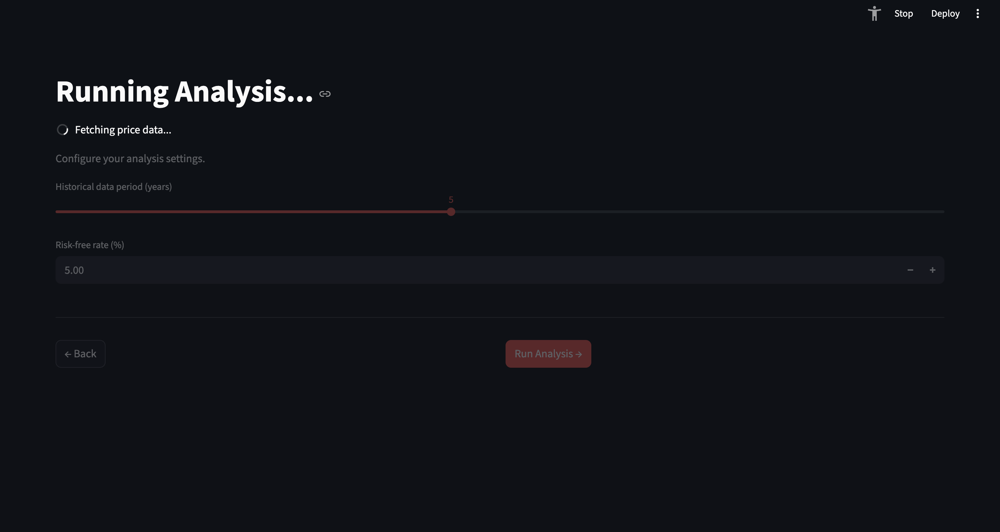
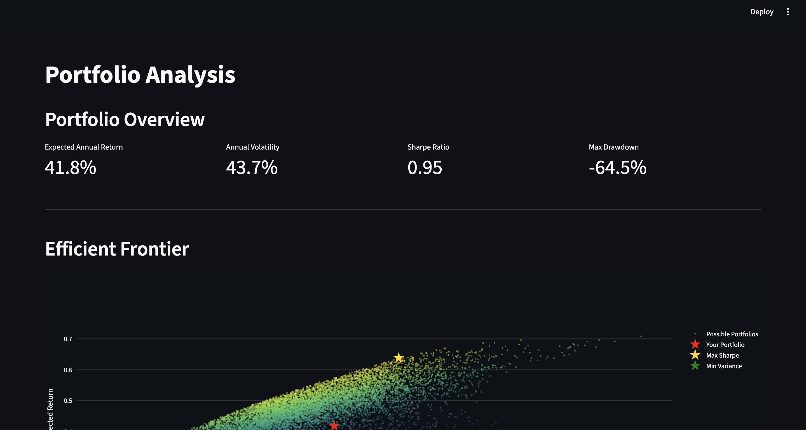
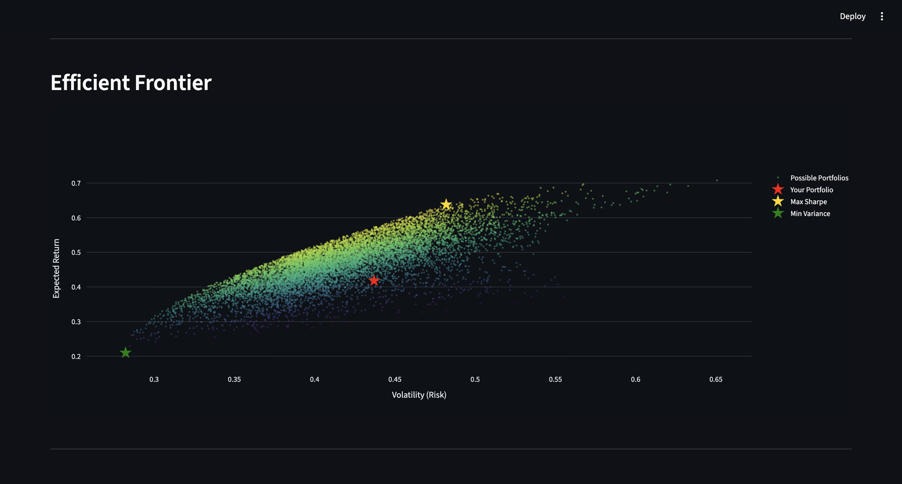
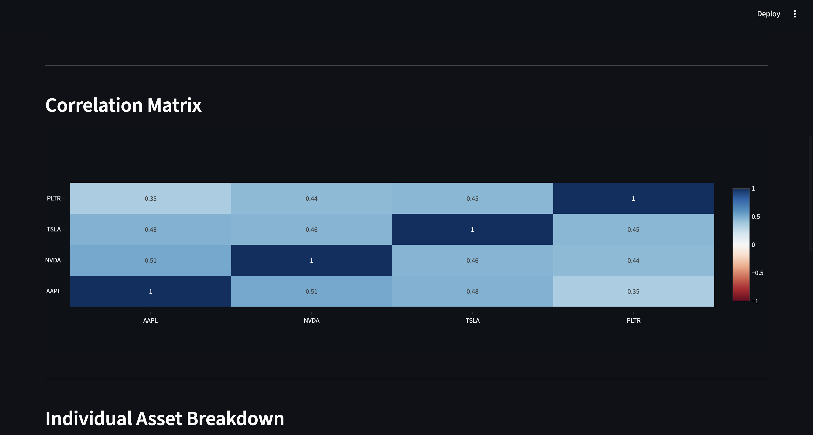
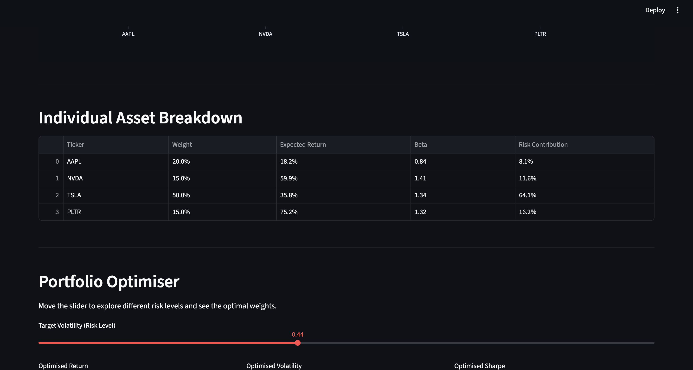
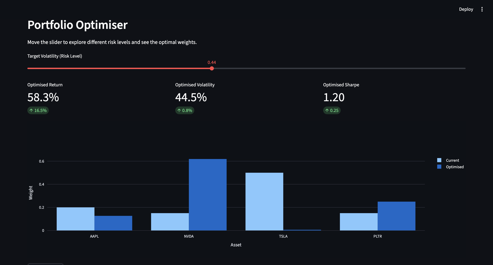

# PORTFOLIO ANALYSER (MODERN PORTFOLIO THEORY)

A quantitative portfolio analysis tool that is built on Moderm Portfolio Theory. 

The tool allows the user to input their portfolio or a portfolio that they are considering.
It fetches real market data using OBB, computes standard portfolio metrics, risks/returns metrics, and runs a 10,000 Monte Carlo optimisation to showcase the efficient frontier and how your portfolio compares.

# Background:
Built to develop a practical understanding of Modern Portfolio Theory.

# Features
Fetcher - Historical data of the users chosen stocks. It also fetches SPY for comparison and to calculate metrics.
Portfolio Metrics - Daily returns, expected annual return, volatility, and Sharpe ratio
Risk Analysis - CAPM beta per asset, marginal risk contribution, and maximum drawdown vs SPY benchmark
Efficient Frontier - Monte Carlo Simulation of 10,000 random weight allocations
Correlation Heatmap 
Portfolio Optimiser

# Tech Stack:
Python
(Steamlit, pandas, numpy, matplotlib, openbb)

# Setup: 
(Please note you need an openbb account)
git clone https://github.com/ChickenKebab/portfolio-analyser.git
cd portfolio-analyser
pip install -r requirements.txt
streamlit run app.py

# Project Structure:
app.py
data/fetcher.py
core/portfolio.py, optimiser.py, portfolio.py
.gitingore
constituents.csv
README.md
requirements.txt

# How it works:
1. Enter your stock picks and weights.
2. Set the historical data period and risk free rate
3. The app fetches historical data and computes MPT metrics
4. Results are displayed across 5 sections: Overview, efficient frontier, correlation matrix, asset breakdown, and optimiser.

# Screenshots

Home Screen (Screen 1):

Input Screen (Screen 2):

Settings Screen (Screen 3):

Loading Screen (Screen 4):

Results Screen (Screen 5):

.

.

.

.

